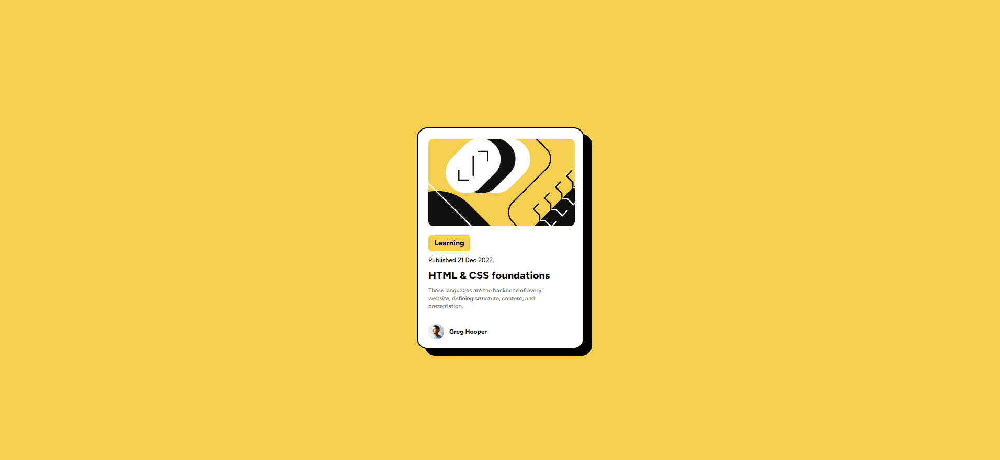

# Frontend Mentor - Blog preview card solution

Esta é uma solução para o [desafio do cartão de visualização do blog no Frontend Mentor](https://www.frontendmentor.io/challenges/blog-preview-card-ckPaj01IcS). Os desafios do Frontend Mentor ajudam você a melhorar suas habilidades de codificação através da construção de projetos realistas.

## Índice

- [Visão geral](#visão-geral)
  - [O desafio](#o-desafio)
  - [Captura de tela](#captura-de-tela)
  - [Links](#links)
- [Meu processo](#meu-processo)
  - [Construído com](#construído-com)
  - [O que aprendi](#o-que-aprendi)
  - [Autor](#autor)
- [Agradecimentos](#agradecimentos)


## Visão geral

### O desafio

Os usuários devem ser capazes de:

- Veja os estados de foco e foco para todos os elementos interativos na página

### Captura de tela




### Links

- URL da solução: [Adicione o URL da solução aqui](https://github.com/LuizFernandoFagundes/BlogCard)
- URL do site ativo: [Adicione o URL do site ativo aqui](https://github.com/LuizFernandoFagundes/BlogCard)

## Meu processo

### Construído com

- Marcação HTML5 semântica
- Propriedades personalizadas CSS
- Caixa flexível


### O que eu aprendi

Use esta seção para recapitular alguns de seus principais aprendizados ao trabalhar neste projeto. Escrevê-los e fornecer exemplos de código das áreas que você deseja destacar é uma ótima maneira de reforçar seu próprio conhecimento.

Para ver como você pode adicionar trechos de código, veja abaixo:

```html
<p class="autor">Greg Hooper</p>
```
```css
main .container .autor::before {
    content: '';
    position: absolute;
    height: 30px;
    width: 30px;
    background-image: url('../img/image-avatar.webp');
    background-repeat: no-repeat;
    background-size: 100%;
    background-position: center;
    left: 0;
}
```


## Autor

- Site - [Luiz Fernando](https://www.seu-site.com)
- Mentor de Frontend - [@Luizfernando](https://www.frontendmentor.io/profile/LuizFernandoFagundes)

## Agradecimentos

Gostaria de agradecer aos professores do curso devQuest, e ao incrivél tipo de suporte, sem eles não seria possível a conclusão desse desafio.
com o conteudo muito bem explicado e com as aulas extremamente incriveis, pude chegar até aqui.
Quero expressar minha sincera gratidão por todo o apoio e incentivo que vocês tem me dado.
